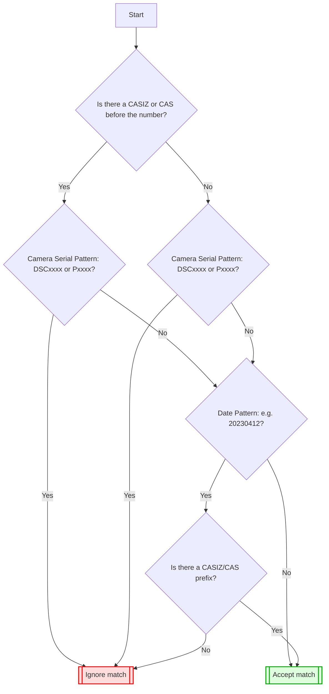

# 🧭 CASIZ Extraction Workflow – IZ Importer

This document describes the step-by-step **workflow used by the IZ Importer** to find CASIZ IDs from an image. The process follows a logical fallback strategy that attempts to extract CASIZ identifiers from various metadata sources like the filename, EXIF data, and directory name.

---

## 🧱 High-Level Structure

The CASIZ ID extraction starts from the top-level `get_casiz_ids` method and goes through the following stages:

---

## ✅ Matching Success

At **any stage**, if a valid CASIZ number is extracted, it is stored in `self.casiz_numbers` and the workflow **short-circuits**, skipping the remaining steps.

---

## ❌ Matching Failure

If all three stages fail:
- `get_casiz_ids()` returns `False`
- No CASIZ ID is stored or associated with the image

---

## 🧩 Step-by-Step Workflow

### 1. `get_casiz_ids(image_path)`

This is the main entry point for CASIZ extraction. It performs a **sequential attempt** to find CASIZ data from three potential sources by the following order:

- First it will look into the **image filename** (see 2.1)
- Then it will look into the **directory name** (see 2.2)
- Last it will look into the **EXIF metadata** (see 2.3)

> ⚠️ **Important:**  
> The process stops immediately once a match is found in any step.  
> For example, **if CASIZ ID is found in the filename, the EXIF and directory steps are skipped.**

For each of the step above, IZ importer will try the same way to extract the casiz number (see section `CASIZ Extraction Rules` below)

---

### 2.1 📁 `attempt_filename_match`

This function checks whether the **base filename** contains any recognizable CASIZ patterns.

---

### 2.2 📂 `attempt_directory_match`

If filename match fails, the importer attempts to extract CASIZ ID from the **directory path** containing the image.

---

### 2.3 🧾 `get_casiz_from_exif`

If both the filename and directory match fail, this function tries to extract a CASIZ ID from the image's **EXIF metadata** (e.g., description or title fields).

It will try to extract casiz from the following fields: (see metadata repo for more details on those constant definitions)

| EXIF Tag |
|----------|
| EXIFConstants.IPTC_KEYWORDS |
| EXIFConstants.XMP_DC_SUBJECT |
| EXIFConstants.XMP_LR_HIERARCHICAL_SUBJECT |
| EXIFConstants.IPTC_CAPTION_ABSTRACT |
| EXIFConstants.XMP_DC_DESCRIPTION |
| XMP:Description |
| EXIFConstants.EXIF_IFD0_IMAGE_DESCRIPTION |
| EXIFConstants.XMP_TITLE |

---

## 3. 🔎 CASIZ Extraction Rules

✅ Following pattern will be used to extrac CASIZ:

This is the **main** search rule.

### Step-by-Step:

1. **Not inside a word**  
   - The match must not be inside another word (e.g., `mycas123` won't match).

2. **Look for CASIZ or CAS (optional)**  
   - Searches for "CASIZ" or "CAS" (case-insensitive: "casiz", "Cas" are fine).
   - Allows spaces, underscores `_`, dashes `-`, or `#` between the word and the number.
     - Example matches: `CAS_1234`, `cas-1234`, `casiz#1234`.

3. **Skip fake matches (IZACC)**  
   - If `IZACC` comes before the number, it is **ignored**.

4. **Check the number itself**  
   - Must be a **3 to 12 digit** number.
   - Must **not** match camera serial number patterns:
     - Nikon: `DSC1234`
     - Olympus: `P1234`
   - Must **not** look like a date (e.g., `20230412`), **unless** it has a CAS or CASIZ prefix.

5. **Finish carefully**
   - If a "CAS" or "CASIZ" prefix is present, anything can follow the number (letters, symbols, etc.).
   - If there’s **no prefix**, the number must end cleanly (with a space, dash, underscore, `#`, or end of text).

# 🧩 CASIZ Number Extraction Flow

---

### 3.2 single casiz match

✅ Matches:
- Prefixed forms like:
  - cas_123
  - casiz_test_123
  - cas_abc_123456
  - cas_abc_1234
  - cas_x-1234
  - cas1234
- Unprefixed numeric strings:
  - 12345, 6789012 (within 5 to 10 digits)

❌ Does not match:
- Prefixes shorter than "cas" (e.g., "ca 125")
- Numbers with fewer than 3 digits after prefix (e.g., "cas 1")
- Standalone numbers with fewer than 5 digits (e.g., "12")
- Numbers without proper prefix format (e.g., "image123 _something-4444 file999")

---

### 🧪 Example Inputs & Outcomes

| Input Filename                   | Directory              | EXIF                                                   | Extracted CASIZ Numbers | REASON                                  |
|----------------------------------|------------------------|--------------------------------------------------------|--------------------------|------------------------------------------|
| casiz_12345_and_cas_67890.jpg    | some dir               | empty                                                  | [12345, 67890]           | match in file                            |
| 12345_or_67890.png               | some dir               | `{EXIFConstants.XMP_DC_DESCRIPTION: 22354}`            | [12345, 67890]           | match in file, ignore the rest           |
| cas-123_image.jpg                | directory 22345        | `{}`                                                   | [123]                    | match in file (short length but has `cas` prefix) |
| cas 1 mas test.tiff              | directory 77910        | `{EXIFConstants.XMP_DC_DESCRIPTION: 22354}`            | [22354]                  | match in EXIF, ignore directory          |
| test.tiff                        | directory 13345        | `{EXIFConstants.XMP_DC_DESCRIPTION: test}`             | [13345]                  | match in directory                       |
| image123 _something-4444 file999 | parent_directory/abc   | empty                                                  | None                     | no match in any resources                |

